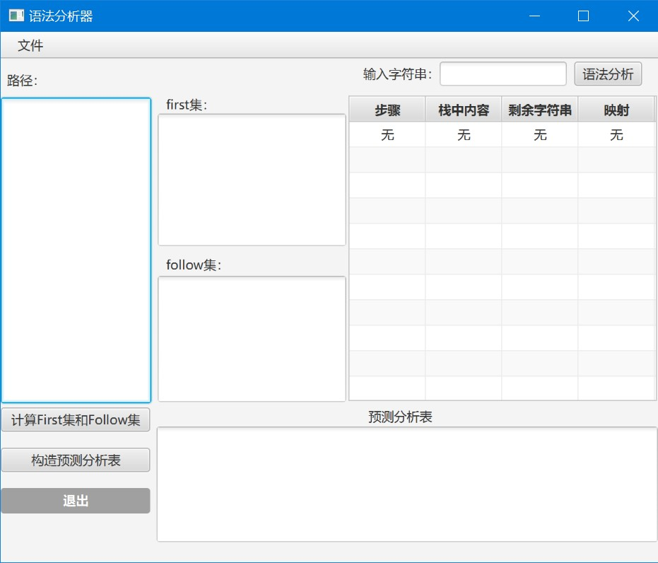
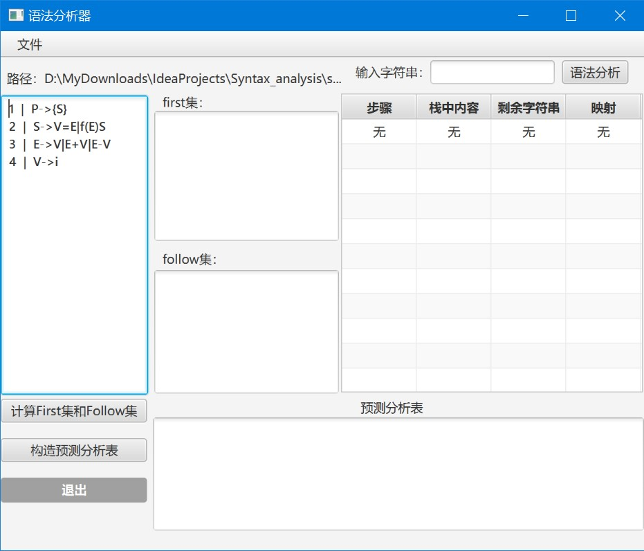
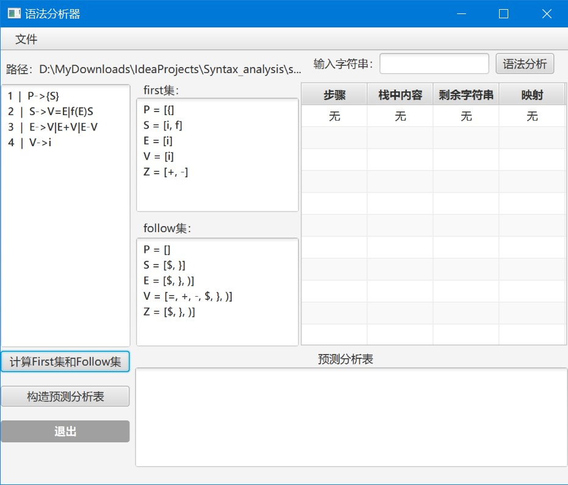
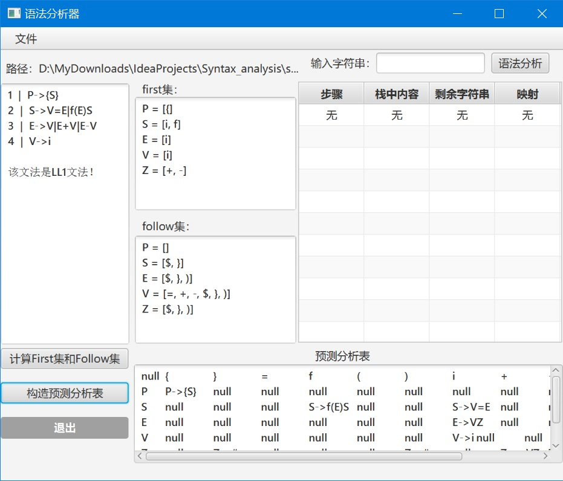
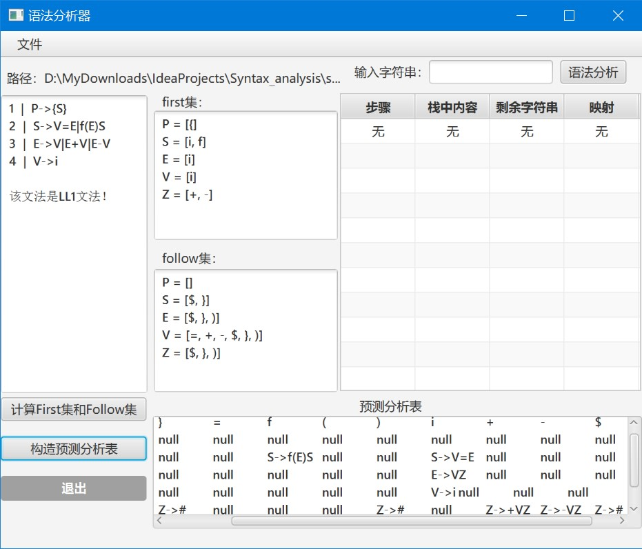
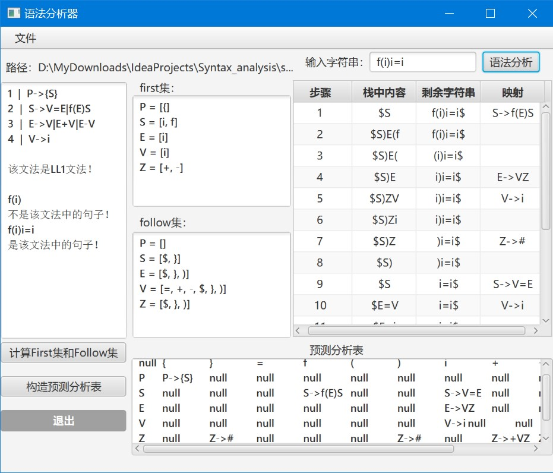
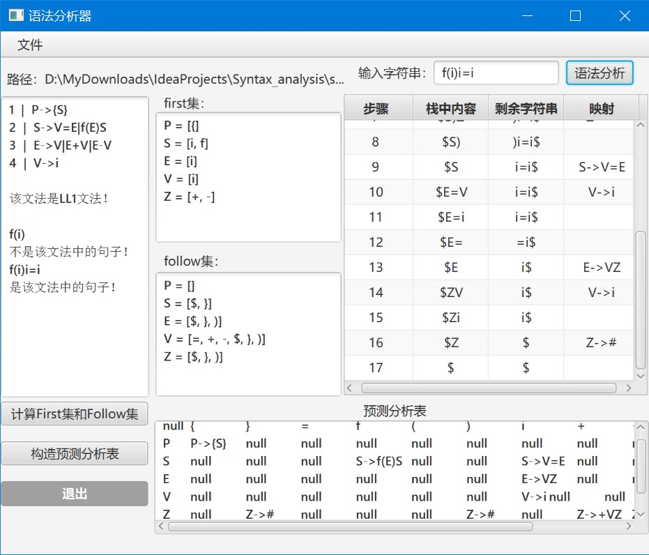
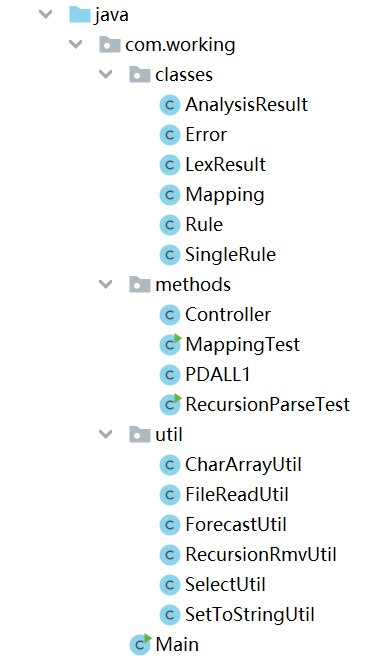

## Compilation-principle
A Simple Syntax Analysis Program 
编译原理：一个简单的LL1语法分析器 

 

### 主要功能
---
<ul>
  <li>从本地导入文件</li>
  <li>计算文件中语法的first集和follow集</li>
  <li>判断是否为LL（1）文法，是则构造预测分析表</li>
  <li>输入字符串，判断是否为该语言中的句子，是则输出分析过程</li>
</ul>

<b>* 因未实现词法分析和语法分析的连接，文法中只能以单个字符为终结符号，字符串分析也只能以单个字符为终结符号，不能读入单词，以后会继续改进</b> 
 

### 运行示例
---

 

### 目录结构
---
>src.main.java......Sources 
>>main.com.working......Java类，包括工具类、主类等 

>resources......Resources 
>>txt......测试文法和测试字符串 
>Overview.fxml......JavaFx的外部页面，存放菜单 
>RootLayout.fxml......JavaFx的内部页面，放在Overview.fxml内，存放各部分页面内容 
>style.css......JavaFx的样式表 

>report&ppt......实验报告和答辩ppt 
 

    Mapping: 存放语法规则的映射。以一个非终结符号key（规则左部）为单位，存放key和其对应的value（所有规则右部的字符串）。其中的方法包括从文件中读取语法规则字符串、形成映射、计算所有key对应的first集和follow集、判断是否符合LL(1)文法要求。
    Rule: 存放单个key对应和其对应的所有规则values。其中的方法包括计算单个key对应单个first集和follow集、判断单个key的规则是否符合LL(1)文法要求。
    PDALL1: LL(1)的下推自动机，用来分析字符串是否是该语言文法中的句子。用栈结构以单个字符为单位实现对字符串的分析判断，并用字符串的列表形式记录下整个分析过程。
    ForecastUtil: 实现预测分析表的构造，结果用字符串类型的二维数组表示。
    RecursionRmvUtil: 消除规则映射中的左递归，检测出规则中的左递归并用新的规则代替，从而消除左递归。
<b>\* 项目中的ε均用#代替。</b> 
